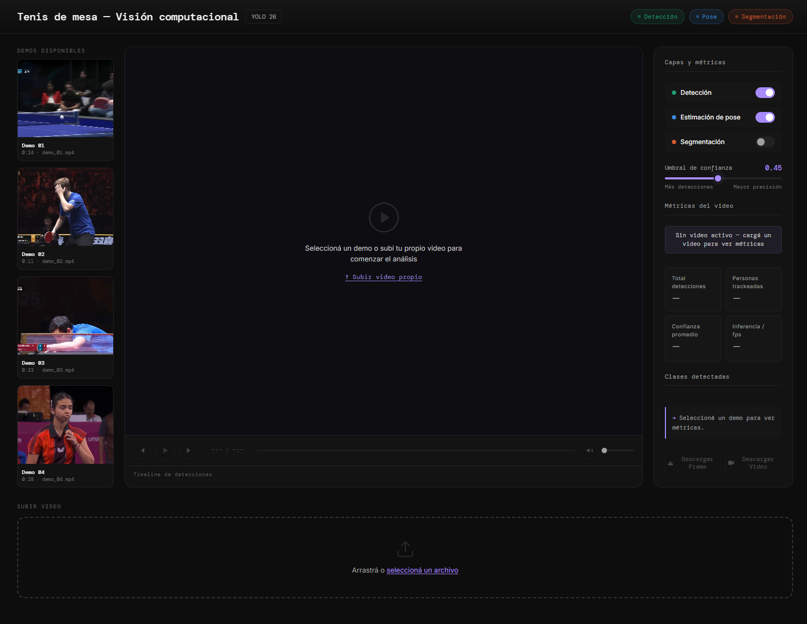

<div align="center">
  <h1>Table Tennis CV — Visión Computacional</h1>
  <p><em>Detección de objetos personalizados, segmentación de instancias y estimación de pose en tiempo real utilizando YOLO.</em></p>

  

  <br><br>

  <p>
    <a href="https://agustinahourcade.github.io/table-tennis-cv/"><strong>Ver Dashboard en Vivo</strong></a>
  </p>
</div>

---

## Visión General del Proyecto

Este repositorio contiene el desarrollo del **Proyecto Integrador** para la cátedra de **Redes Neuronales**. El objetivo central es proporcionar una solución integral de visión artificial capaz de analizar partidas de tenis de mesa (Ping Pong) desde secuencias de video.

La arquitectura implementa un pipeline basado en la familia de modelos **YOLO** para resolver tres problemas fundamentales de Computer Vision simultáneamente:
1. **Object Detection**: Detección de elementos específicos del entorno de juego.
2. **Instance Segmentation**: Segmentación a nivel de píxel de objetos secundarios.
3. **Pose Estimation**: Seguimiento articular y análisis biomecánico de los jugadores.

---

## Características Principales

- **Detección de Clases Personalizadas (Custom Object Detection)**: Modelo afinado (*Fine-Tuned*) vía Transfer Learning para detectar elementos críticos no presentes en datasets estándar (COCO):
  - `TT Racket`: Paletas de tenis de mesa.
  - `TT Table`: Mesa de juego.
  - `TT Net`: Red de la mesa.
- **Estimación de Pose (Pose Estimation)**: Extracción de *keypoints* esqueléticos de los jugadores en tiempo real, permitiendo análisis de posturas, desplazamientos corporales y mecánicas de juego.
- **Segmentación Inteligente (Instance Segmentation)**: Máscaras de segmentación para objetos contextuales, aplicando filtros de exclusión en tiempo de inferencia para evitar la superposición de máscaras con clases personalizadas y siluetas de jugadores.
- **Dashboard Analítico (Frontend UI)**: Interfaz de usuario construida para visualizar las métricas del modelo, inferencias y reportes en vivo de forma accesible y profesional.

---

## Arquitectura de Modelos & Dataset

### Dataset Personalizado
La recolección, curación y preprocesamiento de las imágenes se gestionó utilizando la plataforma **Roboflow**. Se garantizó la robustez visual aplicando técnicas de **Data Augmentation** para lidiar con variaciones de iluminación, desenfoque de movimiento (*motion blur*) natural del deporte y diferentes perspectivas de cámara.

### Pipeline de Inferencia
El núcleo de procesamiento se nutre de las implementaciones optimizadas de la librería **Ultralytics** (YOLO26):
- **Backbone & Head**: Arquitectura ajustada para la inferencia en tiempo real, priorizando el compromiso entre el *Mean Average Precision* (mAP) y la latencia computacional (FPS).
- **Lógica de Integración**: Funciones customizadas para unificar los outputs de las distintas redes (cajas delimitadoras, máscaras de segmentación y tensores de coordenadas articulares) en un único frame renderizado, superponiendo KPIs en tiempo real.

---

## Estructura del Repositorio


```text
TPI-Redes-Neuronales/
├── data/                       # Datasets, configuraciones YAML (data.yaml) y metadatos
├── deploy/                     # Scripts y configuración para despliegue
├── frontend/                   # Código fuente del Dashboard UI interactivo
├── models/                     # Modelos .pt y .onnx
├── notebooks/                  # Jupyter Notebooks (Transfer Learning y pruebas)
│   ├── runs/                       # Salidas de entrenamiento (curvas de pérdida, weights, logs)
├── src/                        # Código base del sistema de visión artificial
│   ├── api/                    # Directorio de la API
│   │   └── backend.py          # API Backend en FastAPI para el procesamiento de video
│   ├── config.py               # Configuraciones del proyecto
│   └── export_onnx.py          # Script para exportar modelos de YOLO a ONNX
├── .gitignore                  # Reglas de control de versiones
├── requirements.txt            # Dependencias del entorno de Python
└── README.md                   # Documentación técnica (Este archivo)
```


## Evaluación y Métricas

- **Arquitectura Base**: Ultralytics YOLO26
- **Métricas de Performance del Modelo**:
  - **mAP50**: 0.7817
  - **mAP50-95**: 0.6161
  - **Precision (P)**: 0.8836
  - **Recall (R)**: 0.7163
